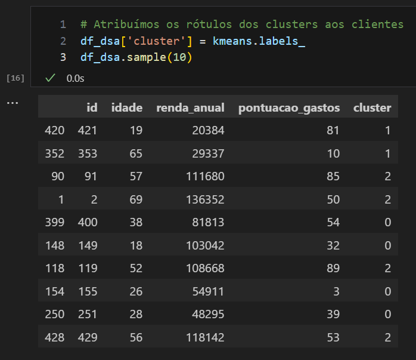

<div align="center">
  
  
</div>

Este repositório estrutura o conteúdo da segunda metade do curso "Business Intelligence e Data Science" da Data Science Academy (~ 70 horas de duração, nível intermediário).  inclui um portfolio de projetos construídos com base na primeira metade do mesmo curso.

### Qual o porquê da separação?
A primeira metade do curso é voltada para a funcionalidade do Power BI: visualizações, linguagem DAX e M, funcionalidades nativas, etc.
**Já a segunda metade, observada neste repositório, possui como foco:**
1. A integração do Power BI com Bancos de dados;
2. O uso de SQL Analytics neste contexto;
3. Aplicação de técnicas de _Machine Learning_ para segmentação e detecção de anomalias, com o auxílio de linguagens Python e R;
4. O uso de Inteligência Artificial para análise de séries temporais no Power BI; e
5. Um estudo de caso

A oportunidade é fortuita para o aprendizado de algumas aplicações acessórias como ODBC e SQLite.

Em conjunto, estes exercícios começam a integrar as diferentes ferramentas com as quais possuo familiaridade na área de ciência de dados.

<br>

---

<h1 align="center">1. A integração do Power BI com Bancos de Dados</h1>

Embora eu esteja familiarizado com DBMS's como PostgreSQL/MySQL e suas respectivas utilizações em GUI's como pgAdmin4/MySQL Workbench, o projeto atual permite a interação com duas novas ferramentas cuja interação foge do par usual DMBS <--> Interface Gráfica:

- o **SQLite** é um sistema de banco de dados leve e sem servidor.
  - Diferentemente do PostgreSQL/MySQL, o SQLite não exige um servidor dedicado; o banco de dados é apenas um único arquivo no disco.
  - Frequentemente usado em projetos pequenos, sistemas embarcados ou situações onde a simplicidade é mais importante do que a escalabilidade. Comum, por exemplo, em aplicações de smartphones.
  - O SQLite não possui uma ferramenta GUI nativa como o pgAdmin4 ou MySQL Workbench, mas pode ser usado com ferramentas de terceiros como o DB Browser for SQLite ou DBeaver.

- O **ODBC (Open Database Connectivity)** é uma API padronizada para acessar diferentes sistemas de banco de dados.
  - Ele funciona como uma ponte entre aplicações e DBMS's, permitindo que interajam *independentemente* do tipo de banco de dados subjacente.
  - O ODBC **não** é um sistema de gerenciamento de banco de dados, mas um meio de conectar-se a um.
  - Ou seja, é um intermediário que permite que diferentes aplicações se comuniquem com bancos de dados. Ele não é diretamente comparável aos pares mencionados acima, mas complementa o SQLite (ou qualquer banco de dados) ao fornecer uma maneira padronizada de se conectar a ele.

  ---

O ODBC Driver existe na versão Trial, no momento de criação deste projeto, com licença de 30 dias. Devido ao propósito didático do projeto, isto não configura um problema.

<div align="center">
  
</div>

<br>
A conexão é, de fato, realiada da maneira mais sucinta possível, seguindo o paradigma enxuto do SQLite. Não há servidor dedicado de hospedagem, a base de dados é armazenada em um único arquivo em disco:

<br>

<div align="center">
  
</div>

<br>

Após a conexão com o SQLite e a ingestão dos dados, podemos utilizar instruções SQL para realizar filtros ou gerar novas vistas. Algo como:
```
SELECT Nome_Produto,
        ROUND(MIN(Valor_Venda, 2) AS valor_mínimo),
        ROUND(MAX(Valor_Venda, 2) AS valor_máximo),
        ROUND(AVG(Valor_Venda, 2) AS valor_médio),
        ROUND(SUM(Valor_Venda, 2) AS valor_total),
        COUNT(Valor_Venda) AS contagem,
        Ano
FROM TB_DSA_VENDAS, TB_DSA_PRODUTOS, TB_DSA_PEDIDOS,
WHERE TB_DSA_VENDAS.produto = TB_DSA_PRODUTOS.id_produto
AND TBD_DSA_VENDAS.pedido = TB_DSA_PEDIDOS.id_pedido
GROUP BY Produto, Ano
ORDER BY Contagem DESC
LIMIT 1000
```

Caso contrário, as tabelas são carregadas no ambiente do Power BI e seguimos com o tratamento padrão:

<br>

<div align="center">
  
</div>

<br>

Embora o Power BI não seja uma ferramenta dedicada para a modelagem de dados estruturados (como o pgModeler, por exemplo), ele é capaz de realizar a manutenção básica. Veja na figura abaixo que o Power BI reconhece o modelo semântico que estrutura as diferentes tabelas envolvidas, bem como as 3 relações "1-para-muitos" que conectam as chaves primárias (em pedidos, produtos e clientes) à tabela central "vendas".

<br>

<div align="center">
  
</div>

<br>

## Preâmbulo sobre Machine Learning

O aprendizado de máquina pode ser dividido em três categorias principais:

1. Aprendizado Supervisionado: no qual o algoritmo é treinado com um conjunto de dados rotulados, ou seja, com entradas e saídas conhecidas. O algoritmo utiliza esses dados  para  aprender  a  mapear  as  entradas  nas  saídas  corretas.  Exemplos comuns incluem classificação de imagens e previsão de preços

2. Aprendizado Não Supervisionado: Aqui, o algoritmo é treinado com um conjunto de dados não rotulados, e seu objetivo é encontrar padrões e estruturas subjacentes nos dados. Exemplos comuns incluem agrupamento e redução de dimensionalidade.

3. Aprendizado Por Reforço: Neste tipo de aprendizado, o algoritmo, chamado de agente, aprende a tomar decisões com base em recompensas e punições. O agente interage com um ambiente e ajusta suas ações para maximizar as recompensas a longo prazo. Exemplos comuns incluem jogos e robótica.

Neste projeto, será realizado um processo de _clusterização_, ou seja, **aprendizado não supervisionado**. Os detalhes são descritos abaixo

---

<h1 align="center">2. Segmentação de clientes com Machine Learning em linguagem Python</h1>


A segmentação de clientes é o processo de dividir a base de clientes de uma empresa em grupos  distintos  com  base  em  características  comuns,  necessidades,  comportamentos  ou preferências.  O  objetivo  da  segmentação  é  entender  melhor  as  necessidades  e  desejos  de diferentes  grupos  de  clientes  e,  assim,adaptar  as  estratégias  de  marketing,  comunicação  e vendas para atender a essas necessidades de maneira mais eficaz e personalizada.

A segmentação pode ser feita com base em diversos critérios, como:
1. Demográficos:  Idade,  sexo,  estado  civil,  renda,  ocupação,  nível  de  educação  e tamanho da família;
2. Geográficos:  Localização,  clima,  densidade  populacional  e  fronteiras  políticas  ou culturais;
3. Psicográficos: Estilo de vida, personalidade, valores, atitudes e interesses;
4. Comportamentais:  Padrões  de  compra,  frequência  de  uso,  lealdade  à  marca, preferências e atitudes em relação a produtos e serviços.

A segmentação de clientes pode beneficiar as empresas de várias maneiras, incluindo:
1. Compreender melhor as necessidades e expectativas de diferentes grupos de clientes;
2. Desenvolver campanhas de marketing e comunicação mais eficazes e personalizadas;
3. Identificar oportunidades de mercado e nichos ainda não explorados;
4. Melhorar a satisfação e retenção de clientes, oferecendo produtos e serviços mais adequados às suas necessidades; e
4. Otimizar a alocação de recursos, concentrando-se nos segmentos de clientes mais lucrativos ou com maior potencial de crescimento.

As empresas podem utilizar técnicas de análise de dados e aprendizado de máquina para segmentar sua base de clientes de forma mais precisa e sofisticada, identificando padrões e relações complexas entre diferentes variáveis e comportamentos.

Nesta seção, o aprendizado de máquina será utilizado para segmentar clientes de acordo com determinadas características. O problema é proposto sucintamente da seguinte forma:

Imagine que uma empresa tenha dados históricos de clientes que fizeram compras de produtos ou serviços. Os dados incluem,para cada cliente: idade, renda anual e uma pontuação de gasto(poder de compra do cliente). A empresa gostaria de segmentar esses clientes em 3 grupos de acordo com similaridades a fim de personalizar as campanhas de Marketing. O gestor da área de Marketing espera receber um relatório com os 3 segmentos e para cada segmento a média de idade, renda anual e pontuação de gastos dos clientes.

---

Realizada uma análise exploratória dos dados, inicia-se o aprendizado de máquina. É necessário, antes de mais nada, realizar o pré-processamento dos dados. O algoritmo de aprendizado não-supervisionado KMeans (escolhido nesse caso devido ao problema de negócios, o qual envolve clusterização) espera receber dados padronizados i.e. na mesma escala. Como não iremos avaliar o modelo, não haverá divisão em grupos treino/teste. O processo é sucintamente descrito no código abaixo:

```
# Imports
import pandas as pd
from sklearn.cluster import KMeans
from sklearn.preprocessing import StandardScaler

df_dsa = pd.read_csv('recursos/dados/dados_clientes.csv') # Carrega os dados

df_dsa[['idade', 'renda_anual', 'pontuacao_gastos']].describe() # Resumo estatístico

padronizador = StandardScaler() # Criando o padronizador dos dados

# Aplica o padronizador somente nas colunas de interesse
dados_padronizados = padronizador.fit_transform(df_dsa[['idade', 'renda_anual', 'pontuacao_gastos']])

k = 3 # Definindo o número de clusters (k)

kmeans = KMeans (n_clusters = k) # o modelo é criado

kmeans.fit(dados_padronizados) # treinamento do modelo com dados padronizados

df_dsa['cluster'] = kmeans.labels_ # atribuímos os rótulos dos clusters aos clientes
```

O número de clusters _k_ é o número de agrupamentos que serão realizados sobre os dados; há uma série de técnicas para estimar o melhor valor de k, o que não é abordado aqui. A aplicação do modelo resulta em uma nova coluna, "cluster", indicando a que grupo pertence determinado indivíduo.

<br>

<div align="center">
  
</div>

<br>

Dentro de cada grupo, eu possuo a **maior** similaridade possível.
Entre os grupos, eu possuo a **menor** similaridade possível.

Em linhas gerais: o KMeans compara as distâncias entre cada vetor de dados (as linhas da matriz dados_padronizados), iterativamente, o que permite caracterizá-los.

Esta é uma oportunidade fortuita para demonstrar a funcionalidade de integração de relatórios PowerBI em ambiente Jupyter Notebook, realizada através do pacote _powerbiclient_; este e outros recursos (como a publicação online do relatório) podem ser utilizados através do acesso à Microsoft com uma conta de email institucional. No caso, estou utilizando a minha conta _alumni_ de ex-estudantes da USP. As etapas de construção podem ser verificadas no caderno "projeto_cluster.ipynb" deste repositório. Uma das funcionalidades exibidas é o QuickVisualize, o qual cria _internamente_ no caderno um relatório .pbix; 

```
from powerbiclient import QuickVisualize, get_dataset_config, Report
from powerbiclient.authentication import DeviceCodeLoginAuthentication

device_auth = DeviceCodeLoginAuthentication() # Define a autenticação no Power BI Service

relatorio_PBI = QuickVisualize(get_dataset_config(df_dsa), auth = device_auth) # Cria o relatório no Power BI
```

o PowerBI tenta organizar as informações consideradas mais importantes em uma estrutura de visualizações, geralmente acompanhadas de uma narrativa inteligente. O resultado do código acima é a visualização abaixo:

<div align="center">
  
</div>

<br>

Este recurso, embora interessante para uma rápida visualização, como o nome diz, não necessariamente gera informações relevantes automaticamente (o que pode vir a mudar no futuro recente com a implementação do _Copilot_ em ferramentas como o PowerBI): repare, por exemplo, que o comportamento automático do PowerBI ao lidar com variáveis numéricas é realizar a soma (note os títulos das visualizações, "sum of renda_anual by idade", "sum of id by idade", etc), o que não faz sentido dependendo do contexto, como no caso da idade. Todas estas informações devem ser verificadas e retrabalhadas quando necessário. O "quick_visualizer", no entanto, ao menos da um pontapé inicial e pode vir a ser útil em uma primeira inspeção.

Neste caso específico, é vantajoso retrabalhar as visualizações e a formatação para melhor atender às perguntas realizadas no início da seção. A grande vantagem do QuickVisualize, neste caso, é que podemos publicar o relatório na nuvem e baixar um arquivo pbix já com todas as informações engatilhadas. Não é necessário começar o trabalho do zero. Realizadas as modificações, o resultado final pode ser visualizado no relatório abaixo:

<div align="center">
  
</div>

<br>

Agora, é mais fácil extrair as informações mais relevantes de toda esta análise:

1. O cabeçalho exibe as métricas globais;
2. A média de pontuação de gastos por segmento indica que o segmento 1 deve receber uma atenção maior pela equipe de marketing (são aqueles que mais adquirem produtos/serviços desta empresa).
3. O total de clientes por segmento é balanceado, o que é esperado em uma tarefa de machine learning para segmentação.
4. A média de rendimento anual por segmento indica que o grupo 0 é o que possui maior renda; é interessante notar portanto que uma maior renda não se traduz em uma maior pontuação de gastos.
5. As médias de idade para os segmentos 0 e 1 são quase coincidentes: 53 e 54 anos. O segmento 2 é o que mais destoa neste quesito, com média de 27 anos.

Esta análise pode ser devolvida agora ao departamento de marketing, o qual poderá refinar suas campanhas utilizando como alvo os 3 clusters analisados aqui. Cada campanha, espera-se, será customizada para as características de cada grupo.

---

<h1 align="center">3. Detecção de anomalias com Machine Learning em linguagem R</h1>

A detecção de anomalias, também conhecida como detecção de outliers, é uma técnica em  Machine  Learning  e Estatística  que  visa  identificar  padrões  incomuns,  inesperados  ou anômalos nos dados. Esses padrões podem ser diferentes das observações normais de várias maneiras,  como  magnitude,  frequência  ou  comportamento.  A  detecção  de  anomalias  é importante porque as anomalias podem indicar problemas, erros, falhas, fraudes ou atividades maliciosas e, em muitos casos, é crucial identificar e analisar esses eventos anômalos para tomar decisões informadas e apropriadas.

Existem várias abordagens para detectar anomalias em Machine Learning, algumas das quais incluem:
1. **Métodos Estatísticos**: baseiam-se na análise estatística dos dados, como testes de hipóteses, distribuições de probabilidade e medidas de dispersão (por exemplo, desvio padrão e intervalos interquartis). Observações que estão significativamente distantes da média ou fora dos intervalos esperados são consideradas anômalas.

2. **Aprendizado Supervisionado**:  nesta  abordagem,  um  modelo  de  Machine  Learning  é treinado usando um conjunto de dados rotulado, que inclui exemplos de observações normais e anômalas. O modelo aprende a distinguir entre as duas classes e, em seguida, pode ser usado para  classificar  novas  observações  como  normais  ou  anômalas.

3. **Aprendizado Não Supervisionado**: neste caso, os algoritmos de Machine Learning são usados para analisar dados não rotulados e identificar padrões ou agrupamentos naturais neles. As anomalias são identificadas como pontos de dados que não se encaixam bem em nenhum desses agrupamentos ou que estão significativamente distantes de outros pontos de dados. Alguns exemplos de algoritmos de aprendizado não supervisionado usados para detecção de anomalias incluem clustering (por exemplo, K-means) e técnicas de redução de dimensionalidade (por exemplo, PCA).

4. **Aprendizado Semi-Supervisionado**: esta abordagem combina elementos de aprendizado supervisionado e não supervisionado. Os algoritmos são treinados em um conjunto de dados parcialmente rotulado, que contém exemplos de observações normais e um pequeno número de  exemplos anômalos. O  modelo aprende a distinguir entre as classes e identificar novas anomalias com base nos padrões aprendidos.

5. **Métodos Baseados em Densidade**: esses métodos identificam anomalias como pontos de dados que estão localizados em áreas de baixa densidade do espaço de recursos (atributos). Um exemplo popular de algoritmo de detecção de anomalias baseado em densidade é o DBSCAN (_Density-Based Spatial Clustering of Applications with Noise_)

6. **Métodos Baseados em Vizinhança**: esses métodos comparam a distância ou similaridade entre pontos de dados e seus vizinhos para identificar anomalias. Os pontos de dados que têm vizinhos significativamente diferentes de si mesmos são considerados anômalos. Exemplos de algoritmos que empregam essa abordagem incluem o k-NN (k-Nearest Neighbors) e o LOF (Local Outlier Factor). 

A escolha do método mais adequado para detecção de anomalias depende do contexto, da natureza dos dados, do conhecimento técnico do profissional de análise e do tipo de problema que desejamos resolver.

---

O problema proposto é descrito a seguir:
- Imagine que uma empresa da área financeira tenha dados históricos de clientes com duas transações financeiras (aqui chamadas de “transacao1” e “transacao2”). Os gestores acreditam que algumas dessas transações possam ser fraudulentas e gostariam de identificar as eventuais anomalias. Os gestores não fazem ideia do que seria uma anomalia e pediram sua ajuda para encontrar uma solução. De fato, eles não sabem se anomalias realmente ocorreram. Usando dados fictícios usaremos Machine Learning para agrupar os dados de transações financeiras dos clientes e então detectar e definir as anomalias (se existirem). O resultado deve ser entregue no formato visual através de gráficos no Power BI.

A linguagem R será util em duas frentes nesse caso: para executar o algoritmo de detecção de anomalia e para gerar uma visualização em box-plot, a qual não existe de forma nativa no Power BI (o que, convenhamos, é ligeiramente surpreendente). Para este projeto, utilizamos R e Rtools na IDE RStudio:

<div align="center">
  
</div>

<br>

- Os pacotes _tidyverse, dplyr_ e _readr_ são utilizados na manipulação dos dados;
- _solitude_ traz o algoritmo de machine learning para a detecção de anomalias; e
- _ggplot2_ é, verdade seja dita, seguramente um dos melhores pacotes para visualização de dados atualmente. O revés está na curva de aprendizado relativamente íngrime.

Ao visualizar o conjunto de dados, fica claro que é necessária novamente a escolha por um algoritmo não-supervisionado: não há dados históricos ou "verdade de campo" para balizar o treinamento. O aprendizado será realizado _da capo_, <br>
_in loco_, <br>
_allegro, ma non troppo_..

O algoritmo vai buscar padrões no conjunto de dados e posteriormente buscar aquilo que foge destes padrões. Não há dados de saída (eu ainda não sei o que é anomalia), apenas os dados de entrada. Dentro do pacote _solitude_, podemos utilizar o algoritmo Isolation Forest.

O treinamento e aplicação do algoritmo ao nosso conjunto prévio de dados gera um parâmetro "anomaly score". Quanto maior o anomaly score, maior a chance do registro ser uma anomalia.

<div align="center">
  
</div>

<br>

Observa-se que a vasta maioria dos registros possui um score < 0.60; podemos supor que estes registros de transações não configuram fraudes. Vamos definir como regra que um anomaly score acima de 0.62 é uma anomalia. Podemos agora aplicar um filtro sobre os dados iniciais e utilizar o _ggplot_ para construir um gráfico de dispersão entre as transações do tipo 1 e 2, discriminando aqueles que passam pelo filtro (em azul) e aqueles que não passam (em vermelho):

<div align="center">
  
</div>

<br>

A tabela anomalias_histórico (verifique no arquivo Lab8.R) guarda as transações que não passaram pelo filtro aplicado pelo algoritmo. <br>
O modelo criado pode agora ser utilizado para a verificação de fraude em novos conjuntos de dados. Nota-se que o modelo funciona, mas há definitivamente espaço para refinamento: as transações nas bordas do plot definitivamente fogem ao padrão, mas o modelo não capture todos (e.g. note as transações em azul no canto superior direito); ao mesmo tempo, o modelo identifica como fraudulentas muitas transações na região central-inferior e central-esquerda, próximas ao aglomerado, o que não necessariamente é apropriado. O ajuste do algoritmo de forma iterativa permitirá uma classificação cada vez mais criteriosa.

<div align="center">
  
</div>

<br>

Podemos visualizar a tabela de previsão dos novos dados em formato boxplot. Isto é particularmente interessante para explicitar a presença de outliers. Note, destacado em verde, que as transações ali representadas claramente configuram pares que destoam completamente dos padrões exibidos naquele conjunto de dados. Esta informação poderia ser utilizada para alterar o valor de score que escolhemos como filtro. Talvez 0.62 tenha sido um filtro muito agressivo, e algo superior a 0.63/0.64 seja uma escolha mais criteriosa. Um novo modelo pode ser treinado e o processo refeito para verificação.

<div align="center">
  
</div>

<br>

Neste momento, podemos optar por importar esta visualização para o Power BI, uma vez que lá não conseguimos (ainda) construir boxplots. A visualização "R Script Visual" requer os atributos que estão sendo utilizados _e_ o código-fonte escrito em linguagem R para que a visualização seja processada. Cumpridas estas etapas, podemos seguir a customização do relatório pbix como de praxe.

<div align="center">
  
</div>

<br>

Podemos agora fazer uma última customização do nosso dashboard e construir um relatório final. A grande vantagem da integração entre o visual criado com o pacote ggplot no RStudio e a posterior exportação é que podemos agora usufruir da interatividade usual para visualizações nativas do PowerBI. Observe abaixo:

<div align="center">
  
</div>

<br>

O que antes era um gráfico estático no RStudio agora interage dinâmicamente com as outras visualizações do PowerBI. Esta funcionalidade é extremamente poderosa, ainda mais quando utilizada em conjunto com uma biblioteca do calibre do ggplot.

---

<h1 align="center">4. Inteligência Artificial e Séries Temporais com Power BI</h1>

Existem   várias   técnicas   de   análise   de  séries   temporais,   que   vão   desde modelos estatísticos clássicos a abordagens mais modernas de Aprendizado  de Máquina e Inteligência Artificial. Aqui estão algumas das técnicas mais comuns:

1. **Análise  de Tendências**:  Esta  é uma  das  técnicas  mais  simples,  onde  se  procura  uma tendência persistente ao longo do tempo, como por exemplo um aumento constante ou uma queda nos dados;

2. **Médias Móveis e Suavização Exponencial**: Estas são técnicas para remover o "ruído" de uma  série  temporal,  fazendo  a  média  de  pontos  de  dados  em  um  determinado  número  de períodos de tempo;

3. **Decomposição**: Esta técnica envolve a separação da série temporal em componentes de tendência, sazonalidade e resíduos (o que resta depois de remover a tendência e a sazonalidade);

4. **Modelos Autorregressivos (AR)**: Em  um  modelo  AR,  o  valor  de  uma  variável em um determinado momento é suposto ser uma função linear dos valores anteriores;

5. **Modelos de Médias Móveis (MA)**: Já em um modelo  MA, o valor de uma variável em um determinado  momento  é  suposto  ser  uma  função  linear  dos  erros  de  previsão  dos  pontos anteriores;

6. **Modelos ARIMA (Autoregressive Integrated Moving Average)**: Estes combinam modelos AR e MA e também incluem um termo de "diferenciação" para tornar a série  temporal estacionária;

7. **Modelos de Aprendizado de Máquina (Machine Learning)**: Modelos de aprendizado de máquina  como  redes  neurais,  SVMs,  florestas  aleatórias,  gradient  boosting, etc., podem ser usados para modelar séries temporais. Especificamente, redes neurais como LSTMs e GRUs são particularmente  adequadas  para  séries  temporais por causa de sua capacidade de "lembrar" valores passados;

8. **Modelos de Aprendizado Profundo (Deep Learning)**: Redes Neurais Recorrentes (RNNs) e  suas  variantes  como  Long  Short  Term  Memory  (LSTM)  e  Gated  Recurrent Units (GRUs) são amplamente  usadas  para  modelagem  de séries   temporais. Mais  recentemente, modelos baseados em Transformers estão sendo aplicados à análise de séries temporais. A escolha da técnica apropriada depende do problema específico da série temporal, da natureza dos dados, da disponibilidade de recursos computacionais e de outros fatores.

O Power BI não é uma ferramenta para análise de séries temporais, mas oferece alguns recursos simples que podem ser utilizados para uma análise geral. Serão aplicas duas análises: uma preditiva e uma de detecção de anomalias, no contexto de engenharia de produção. Este setor fornece ao analista uma tabela contendo os atributos "período" (data), "turno", o "range de idade dos funcionários" e o "total de unidades produzidas" em uma determinada indústria.

É importante delimitar alguns conceitos, antes de mais nada:

- **Estacionaridade**:  Uma  série  temporal  é  dita  estacionária  se  suas  propriedades estatísticas, como média, variância e autocorrelação, são constantes ao longo do tempo. Isso significa  que,  independentemente  do  ponto  específico  do  tempo  que  você  selecionar,  as características estatísticas da série temporal serão as mesmas. Esta é uma suposição importante em muitos modelos de séries temporais, porque simplifica as previsões. No entanto, muitas séries temporais do mundo real não são estacionárias, mas podem ser transformadas em séries estacionárias através de métodos como a diferenciação.

- **Tendência**: A tendência refere-se a um padrão de longo prazo na série temporal que mostra uma direção geral. Por exemplo, se as vendas de um produto estão consistentemente aumentando ao longo do tempo, diz-se que há uma tendência de alta. Por outro lado, se a temperatura de uma cidade está consistentemente diminuindo ao longo do tempo, há uma tendência de baixa. A tendência pode ser linear (ou seja, a série aumenta ou diminui a uma taxa constante) ou não-linear.

- **Sazonalidade**: A sazonalidade refere-se a padrões que se repetem em intervalos fixos de tempo. Por exemplo, as vendas de sorvete podem ser mais altas no verão e mais baixas no inverno  todos  os  anos,  o  que  é  um  exemplo  de  sazonalidade  anual.  Da  mesma  forma, a quantidade de tráfego da web pode ser mais alta durante a semana e mais baixa nos fins de semana, o  que  é  um  exemplo  de  sazonalidade  semanal.  Ajustar  a  sazonalidade  pode  ser importante para fazer previsões precisas, especialmente para negócios ou fenômenos que são fortemente influenciados por fatores sazonais.

A  identificação  e  o  ajuste  da  estacionaridade,  tendência  e  sazonalidade  podem  ser essenciais  para  a  modelagem  efetiva  de  séries  temporais  e  para  a  realização  de  previsões precisas.

A detecção de outliers é a primeira ferramenta de inteligência artificial implementada no Power BI (veja abaixo). Essa seção deve ser expandida nas próximas versões do programa. Podemos customizar o intervalo "normal" modificando o nível de Confidencialidade (%): quanto maior, mais agressiva a detecção de observações que estão "fora da média".

<div align="center">
  
</div>

Além disso, analisando a média do total de unidades produzidas ao longo do tempo, podemos nos perguntar se é possível prever como essa produção se conduzirá no futuro. Esta é a análise de forecasting, visualizada no gráfico inferior do dashboard abaixo, já formatado para o resultado final. Esta análise preditiva também pode ser customizada: modificando-se o comprimento da previsão (quanto maior, mais imprecisa é a ferramenta, é claro), ou adicionando efeitos de sazonalidade. Observe que se filtrarmos apenas a faixa etária de "65 anos e acima", o modelo prevê uma queda acentuada na produção de unidades, uma vez que esse grupo possui a pior performance dentre todas as faixas de idade.

<div align="center">
  
</div>

Outras funcionalidades são úteis aqui, principalmente para gráficos de linha, como as opções de "drill up" e "drill down", as quais permitem agrupar os valores em diferentes níveis da hierarquia de data e.g. médias anuais, trimestrais, mensais e assim por diante.

